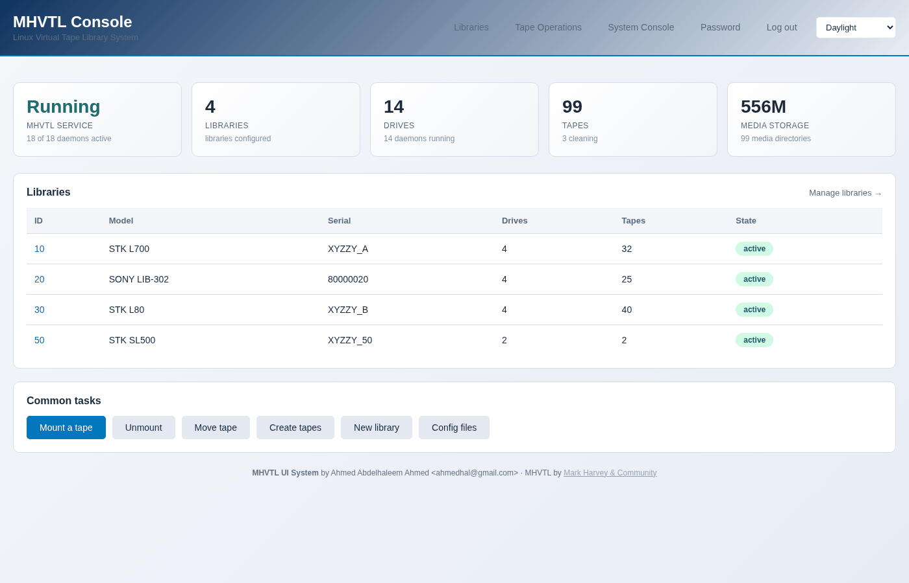
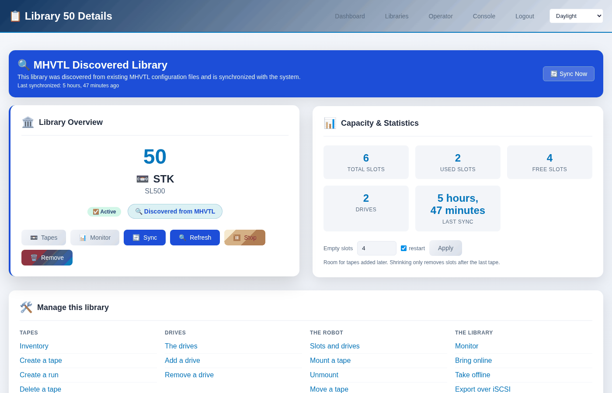
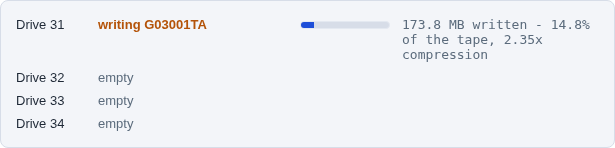
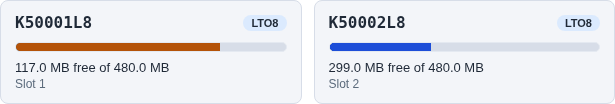

# MHVTL Console

A web console and a command line for [MHVTL](https://github.com/markh794/mhvtl),
the Linux virtual tape library.

It creates libraries, fills them with tapes, moves cartridges with the robot,
exports libraries over iSCSI, and shows what each drive is doing while a
backup writes to it. Everything the web pages do, the `mhvtl` command does
too: both call the same Python services, so neither can do something the
other cannot.



**The library page** - one library, and everything that can be done to it,
with the library already chosen:



**A drive while a backup writes to it**, refreshed every five seconds, and
**each tape with how full it is**:





And what the drives are doing, from the terminal:

```console
$ sudo mhvtl status activity 50

Library 50: 1 of 2 drive(s) hold a tape, 1 working

DRIVE  STATE    BARCODE   COUNTERS
-----  -------  --------  --------------------------------------------
51     writing  K50001L8  300.0 MB written - 29.6% of the tape
52     empty    -         -
```

## Installing

Download the files from the
[latest release](https://github.com/abdelhaleemahmed/mhvtl-console/releases/latest).

**Rocky Linux, AlmaLinux, RHEL 9** - the RPM. It needs MHVTL 1.7 or newer
installed first, and Python 3.12 from the distribution:

```bash
sudo dnf install ./mhvtl-gui-2.1.1-1.el9.noarch.rpm
```

**Other distributions** - the tarball and its installer:

```bash
tar -xzf mhvtl-gui-2.1.1.tar.gz
cd mhvtl-gui-2.1.1
sudo ./install.sh
```

The RPM is built and tested on Rocky Linux 9. The installer also has paths
for Debian and Ubuntu, which have not been tested for this release.

Each release carries `SHA256SUMS`; check the files with
`sha256sum -c SHA256SUMS`.

## First use

Open `http://your-server/` - the console is served by nginx on ports 80
and 443.

The password is `mhvtl`. Change it at `/auth/password/`; every page shows a
warning until you do.

The settings are in `/etc/mhvtl-gui/env`. To reach the console by a name or
address other than `localhost`, add it to `ALLOWED_HOSTS` there, then:

```bash
sudo systemctl restart mhvtl-gui
```

## Documentation

Read them online, in English and Arabic:

- **[User Guide](https://abdelhaleemahmed.github.io/mhvtl-console/user/html/)**
  ([العربية](https://abdelhaleemahmed.github.io/mhvtl-console/user/html-ar/)) -
  what the console does, page by page, with the `mhvtl` command for every
  task.
- **[API Reference](https://abdelhaleemahmed.github.io/mhvtl-console/api/html/)**
  ([العربية](https://abdelhaleemahmed.github.io/mhvtl-console/api/html-ar/)) -
  the Python services, generated from their docstrings.

The sources are in `docs/user/` and `docs/api/`, as Sphinx projects. They
import the application, so to build them yourself use Python 3.12, in a
virtualenv at the top of the checkout:

```bash
python3.12 -m venv venv
venv/bin/pip install -r requirements.txt -r docs/requirements.txt
make -C docs/user html        # docs/user/_build/html/index.html
make -C docs/user html-ar     # the Arabic build
make -C docs/api html
```

## Building the packages

On Rocky Linux 9, with `rpm-build` and `python3.12-devel` installed:

```bash
git clone https://github.com/abdelhaleemahmed/mhvtl-console.git
cd mhvtl-console
./packaging/build.sh          # tarball, RPM, SRPM and SHA256SUMS in packaging/dist/
```

## Licence

GNU General Public License, version 2 only (GPL-2.0-only) - the same licence
as MHVTL. See [LICENSE](LICENSE).

## Credits

- **MHVTL** - Mark Harvey
- **MHVTL Console** - Ahmed Abdelhaleem Ahmed

Issues: [github.com/abdelhaleemahmed/mhvtl-console/issues](https://github.com/abdelhaleemahmed/mhvtl-console/issues)
