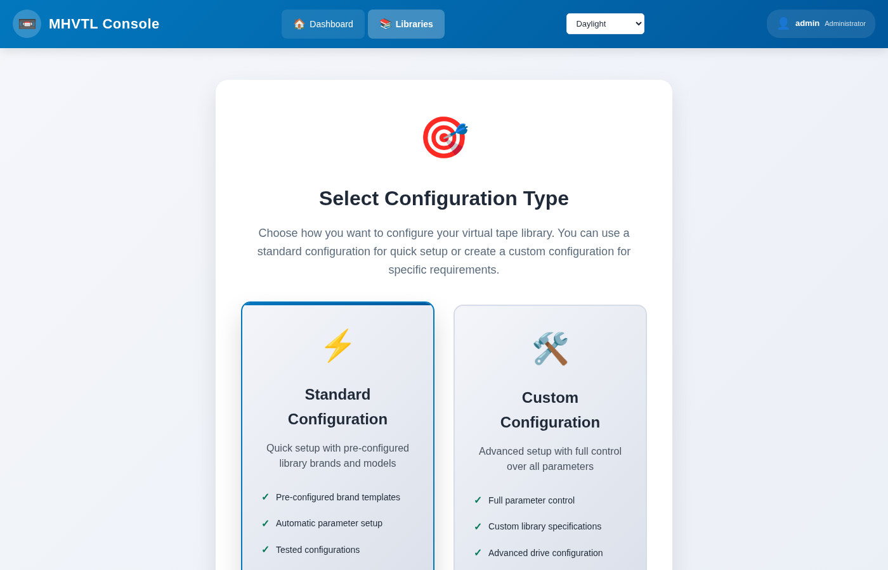
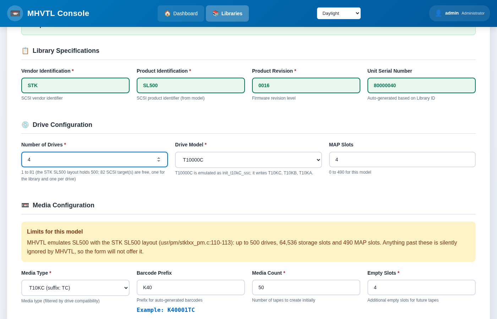

Creating a library
==================

A library is a model - an IBM TS3500, an STK SL500 - with a number of drives,
a number of slots, and cartridges of a generation those drives can load. The
console only offers combinations MHVTL can really emulate, so a library it
lets you build is one that will work.

.. contents::
   :local:
   :depth: 1

In the console
--------------

**Libraries → Create Library**, at ``/libraries/setup/``. Two ways in:

**From a vendor** (recommended)
   Pick a vendor, then a model. The drive list then shows only the drives
   that model takes, with its default chosen; the media list only the
   cartridges that drive writes. The limits on drives, slots and MAP slots
   are the model's own.

**From the tape**
   If you know which cartridge you need, say so first: **Show vendors whose
   libraries can take** leaves only the vendors that can, and carries the
   choice into the form. Choosing ``LTO10`` gets you a model with an
   ``ULT3580-TDA`` drive, ``LTO10`` media and barcodes ending ``LA``.

Then set how many drives, how many slots, and how many empty slots to leave
for tapes added later. Four empty slots is the default; a library with none
cannot take a new tape without being reconfigured.

Press **Create**. The console writes ``device.conf`` and
``library_contents.<id>``, starts the daemons, and creates the tape files.

From the terminal
-----------------

.. code-block:: console

   $ sudo mhvtl library create --profile STK --id 50 --drives 2 \
        --media-type LTO8 --drive-model ULT3580-TD8 --tapes 3 --empty-slots 3

   ok   validate  Specification is valid
   ok   create    Library 50 created: STK SL500 with 2 drives
   ok   restart   Restarted vtllibrary@50.service
   ok   verify    MHVTL can see library 50
   ok   media     3 tape(s) created, 0 already present in library 50
   Library 50 created

Each step is reported, and a failure says which step failed and leaves the
configuration as it was.

=================== ==========================================================
Option              What it does
=================== ==========================================================
``--profile``       The vendor: IBM, STK, SONY, QUANTUM, ADIC, DELL, HP,
                    OVERLAND, SPECTRA
``--id``            The library id; the next free one if you leave it out
``--model``         The library model, if not the profile's default
``--drives``        How many drives
``--drive-model``   The drive model, if not the model's default
``--media-type``    LTO8, LTO9, AIT4 … must be one the drives take
``--tapes``         How many cartridges to create and put in slots
``--empty-slots``   Slots to leave free; the profile's default if omitted
``--no-media``      Create the library but no tape files
``--no-start``      Write the configuration, start nothing
``--dry-run``       Print the ``device.conf`` it would write, and stop
=================== ==========================================================

Which combinations exist
------------------------

Ask, rather than guess:

.. code-block:: console

   $ sudo mhvtl tape media 50          # what this library's drives take

   Drives: ULT3580-TD8, ULT3580-TD8
   DENSITY  SUFFIX  USE         IN DRIVES
   -------  ------  ----------  -----------
   LTO8     L8      read/write  ULT3580-TD8
   LTO7     L7      read/write  ULT3580-TD8

   Default for new tapes: LTO8

If a combination is refused, the message says why: *Media type 'LTO8' is not
supported by drive model 'T10000C'* means that model's default drive does not
take LTO; choose a drive that does with ``--drive-model``.

What it wrote
-------------

.. code-block:: console

   $ sudo mhvtl library show 50

   id              50
   vendor          STK
   product         SL500
   serial          XYZZY_50
   channel         0
   target          18
   lun             0
   home directory  /opt/mhvtl
   drives          2
   drive ids       51, 52
   slots           6
   tapes           3

- ``/etc/mhvtl/device.conf`` gained the library and its drives.
- ``/etc/mhvtl/library_contents.50`` describes its slots.
- ``/opt/mhvtl/<barcode>/`` holds each tape's files.
- ``vtllibrary@50`` and ``vtltape@51``, ``vtltape@52`` are running.

Afterwards
----------

- :doc:`the-library-page` - where the library is worked on
- :doc:`../tapes/create` - more cartridges
- :doc:`../using/iscsi` - let another machine use it
