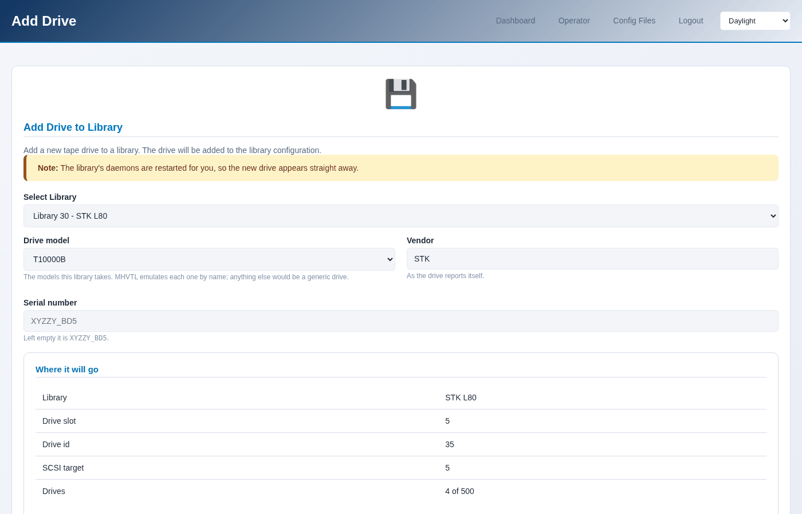
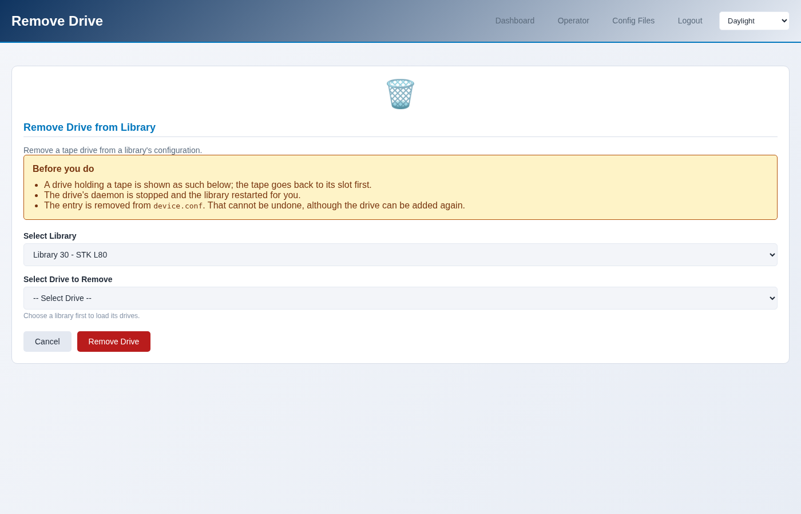

Adding and removing drives
==========================

A library's drives are part of its configuration, so adding or removing one
rewrites ``device.conf`` and restarts the library.

.. contents::
   :local:
   :depth: 1

Adding a drive
--------------

**Operator → Add Drive**, or **Drives → Add a drive** on the library page,
which arrives with the library already chosen.

The page shows what the drive will be before you commit to it: the model,
the serial it will be given, the slot it will occupy, and its SCSI address.
Change the library and all of that changes with it.

Only drives this library's model takes are offered - plus any model the
library already holds, because a library on a real host does not always match
its profile, and refusing a drive identical to the ones already in it would
help nobody.

.. code-block:: console

   $ sudo mhvtl drive add 50

   Drive 53 added to library 50; vtltape@53.service started,
   vtllibrary@50.service restarted

   $ sudo mhvtl drive add 50 --model ULT3580-TD7 --serial ABC123

The slot, the drive id and the SCSI target are chosen for you: they are the
next free ones. Overriding them is not offered, because a drive at an address
something else already uses will not start.

Removing a drive
----------------

**Operator → Remove Drive**, or **Drives → Remove a drive** on the library
page.

The page says what is in the drive before you remove it. A drive holding a
tape has that tape put back in its slot first.

.. code-block:: console

   $ sudo mhvtl drive remove 53

   Drive 53 removed from library 50; vtltape@53.service stopped,
   vtllibrary@50.service restarted

This cannot be undone, although the drive can be added again. What it removes
is the drive's entry in ``device.conf``; no tape is deleted.

What it does to the running library
-----------------------------------

Both restart the library, because MHVTL reads ``device.conf`` once, when a
daemon starts. Until it restarts, its robot reports the drives it had when it
started.

``--no-restart`` writes the configuration and leaves the daemons alone, for
when you are making several changes and want one restart at the end:

.. code-block:: console

   $ sudo mhvtl drive add 50 --no-restart
   $ sudo mhvtl drive add 50 --no-restart
   $ sudo mhvtl service restart --library 50

The console says the same thing, on the page: a library whose configuration
and whose robot disagree is flagged until it is restarted.

Seeing the drives
-----------------

.. code-block:: console

   $ sudo mhvtl drive list 50        # what the configuration says
   $ sudo mhvtl status library 50    # what the robot says is loaded where
   $ sudo mhvtl status activity 50   # what each drive is doing now
   $ sudo mhvtl scsi map             # which /dev node each drive is
