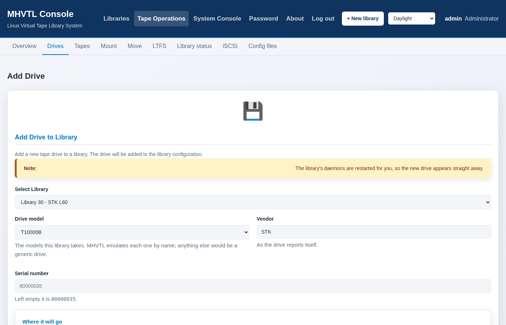
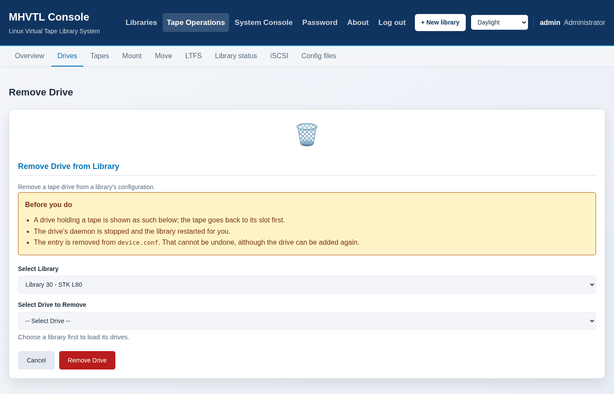

Adding and removing drives
==========================

A library's drives are part of its configuration, so adding or removing one
rewrites ``device.conf`` and restarts the library.

.. contents::
   :local:
   :depth: 1

Adding a drive
--------------

**Operator → Add Drive**, or **Drives → Add a drive** on the library page,
which arrives with the library already chosen.

The page shows what the drive will be before you commit to it: the model,
the serial it will be given, the slot it will occupy, and its SCSI address.
Change the library and all of that changes with it.

Only drives this library's model takes are offered - plus any model the
library already holds, because a library on a real host does not always match
its profile, and refusing a drive identical to the ones already in it would
help nobody.

.. code-block:: console

   $ sudo mhvtl drive add 50

   Drive 53 added to library 50; vtltape@53.service started,
   vtllibrary@50.service restarted

   $ sudo mhvtl drive add 50 --model ULT3580-TD7 --serial ABC123

The slot, the drive id and the SCSI target are chosen for you: they are the
next free ones. Overriding them is not offered, because a drive at an address
something else already uses will not start.

Removing a drive
----------------

**Operator → Remove Drive**, or **Drives → Remove a drive** on the library
page.

The page says what is in the drive before you remove it. A drive holding a
tape has that tape put back in its slot first.

.. code-block:: console

   $ sudo mhvtl drive remove 53

   Drive 53 removed from library 50; vtltape@53.service stopped,
   vtllibrary@50.service restarted

This cannot be undone, although the drive can be added again. What it removes
is the drive's entry in ``device.conf``; no tape is deleted.

What it does to the running library
-----------------------------------

Both restart the library, because MHVTL reads ``device.conf`` once, when a
daemon starts. Until it restarts, its robot reports the drives it had when it
started.

``--no-restart`` writes the configuration and leaves the daemons alone, for
when you are making several changes and want one restart at the end:

.. code-block:: console

   $ sudo mhvtl drive add 50 --no-restart
   $ sudo mhvtl drive add 50 --no-restart
   $ sudo mhvtl service restart --library 50

The console says the same thing, on the page: a library whose configuration
and whose robot disagree is flagged until it is restarted.

Seeing the drives
-----------------

.. code-block:: console

   $ sudo mhvtl drive list 50        # what the configuration says
   $ sudo mhvtl status library 50    # what the robot says is loaded where
   $ sudo mhvtl status activity 50   # what each drive is doing now
   $ sudo mhvtl scsi map             # which /dev node each drive is

.. _mixed-libraries:

Two generations in one library
------------------------------

A library does not have to hold one kind of drive. A real site that has just
bought LTO-9 drives still has shelves of LTO-7 cartridges, and the library
that can read the old tapes and write the new ones is one library with both
kinds of drive in it.

The console builds that in one step, and so does the command line.

In the console
~~~~~~~~~~~~~~

On the library form, **Add another drive type** adds a second row: a model and
a count. **Add another cartridge type** does the same for the media. The
limits still come from the library model, so only drives that model takes are
offered in either row.

The rows are in slot order, which is also SCSI target order - so the first row
is the first drive. A backup application that addresses a drive by its
position notices if that order changes, which is why the order you enter is
the order that is written.

From the terminal
~~~~~~~~~~~~~~~~~

``--drive`` and ``--media`` repeat, each naming a model and how many:

.. code-block:: console

   $ sudo mhvtl library create --profile IBM --model 03584L32 \
        --drive ULT3580-TDA:2 --drive ULT3580-TD9:2 \
        --media LTO10:20 --media LTO9:10 --id 90

Two LTO-10 drives, two LTO-9 drives, twenty LTO-10 cartridges and ten LTO-9
ones. Barcodes follow the runs in order: the first twenty end ``LA``, the next
ten end ``L9``, and the numbering runs straight through the two.

``--drive`` replaces ``--drives`` and ``--media`` replaces ``--tapes``, and
naming both of a pair is refused - a count and a list are two answers to one
question, and nothing can choose between them.

``mhvtl library create --interactive`` asks the same thing as
**Add another drive type?**; see :doc:`create-interactively`.

What a mixed library can load
~~~~~~~~~~~~~~~~~~~~~~~~~~~~~

``mhvtl tape media`` is the one command to ask, because the answer is the
union of what all the drives do, and it is not obvious by inspection:

.. code-block:: console

   $ mhvtl tape media 10
   Drives: ULT3580-TD8, ULT3580-TD8, ULT3580-TD6, ULT3580-TD6
   DENSITY  SUFFIX  USE         IN DRIVES
   -------  ------  ----------  -----------
   LTO8     L8      read/write  ULT3580-TD8
   LTO7     L7      read/write  ULT3580-TD8
   LTO6     L6      read/write  ULT3580-TD6
   LTO5     L5      read/write  ULT3580-TD6
   LTO4     L4      read-only   ULT3580-TD6

   Default for new tapes: LTO8

Five generations in a library with two kinds of drive, and the **USE** column
is the part to read. LTO4 is ``read-only``: that cartridge can be loaded and
read, and the library will refuse to make a new one, because an LTO-6 drive
reads LTO-4 but cannot write it.

The same table is what the tape form offers, so a cartridge the console lets
you create is one the library can really write.

Adding a generation later
~~~~~~~~~~~~~~~~~~~~~~~~~

A library does not have to be built mixed. ``drive add`` takes
``--drive-model``, so the second generation can arrive the way it does in
real life - bought later and racked beside the first:

.. code-block:: console

   $ sudo mhvtl drive add 50 --drive-model ULT3580-TDA

The new drive widens what the library can load, and ``tape media`` says so
immediately. Nothing about the existing drives or cartridges changes.
