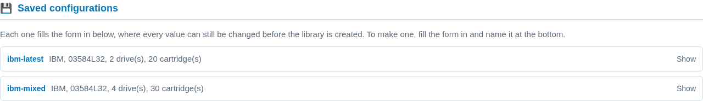

Profiles and presets
====================

Two words for two different things, and the difference matters because one of
them you can change and the other you cannot.

A **profile** is a vendor's catalogue: which libraries IBM makes, which drives
each of those models takes, which cartridges each drive writes. It describes
hardware that exists, it ships with the console, and nothing can edit it.

A **preset** is a configuration *you* built from a profile and gave a name to,
so you can build that library again without retyping it.

Both are templates. Neither is ever a library until you create one from it.

.. contents::
   :local:
   :depth: 1

The nine profiles
-----------------

.. code-block:: console

   $ mhvtl profile list
   ADIC DELL HP IBM OVERLAND QUANTUM SONY SPECTRA STK
   9 profile(s). For one of them:  mhvtl profile show ADIC

``mhvtl profile show IBM`` prints the whole catalogue: every library model
with its drive and slot limits, and every drive model with the densities it
writes and the ones it can only read. It is long, because the real catalogue
is long - thirteen library models and twenty drives for IBM alone.

The useful column is **WRITES**:

.. code-block:: text

   DRIVE MODEL  LTO  WRITES         READS ONLY  DEFAULT
   -----------  ---  -------------  ----------  -------
   ULT3580-TD7  7    LTO7, LTO6     LTO5        no
   ULT3580-TD8  8    LTO8, LTO7     -           yes
   ULT3580-TD9  9    LTO9, LTO8     -           no
   ULT3580-TDA  10   LTO10, LTO10P  -           no

A profile has no write verbs at all - no ``profile set``, no ``profile
delete``. There is nothing to edit: if a drive is not in the list, the vendor
does not make it, and making one up would produce a library that identifies
itself as hardware that does not exist.

.. note::

   **A vendor's default is not its newest.** IBM's default drive is the
   ULT3580-TD8, which writes LTO8, while its catalogue reaches the
   ULT3580-TDA and LTO10. Quantum's default is an SDLT600, which is not LTO at
   all. So ``mhvtl library create --profile QUANTUM`` on its own builds an
   SDLT library - correct, and probably not what you wanted. Naming the drive
   and the density is what pins a library to the newest generation.

What a preset is for
--------------------

This is a complete, working command:

.. code-block:: console

   $ sudo mhvtl library create --profile IBM --model 03584L32 \
        --drive-model ULT3580-TDA --media-type LTO10 \
        --drives 2 --tapes 20 --empty-slots 4

Typing it twice is how the second library ends up subtly different from the
first. Name it once and it becomes:

.. code-block:: console

   $ sudo mhvtl library create --preset ibm-latest --id 90

Eleven are installed with the console
-------------------------------------

``/etc/mhvtl-gui/presets.toml.example`` ships one library for every vendor, at
the newest cartridge that vendor's drives can write. Copy a table out of it
into ``presets.toml`` beside it, or just read it to see what the keys look
like.

.. code-block:: console

   $ mhvtl preset list
   NAME             BUILDS
   ---------------  -------------------------------------------------
   adic-latest      ADIC, Scalar i2000, 2 drive(s), 20 cartridge(s)
   dell-latest      DELL, PV-136T, 2 drive(s), 20 cartridge(s)
   hp-latest        HP, MSL G3 Series, 2 drive(s), 20 cartridge(s)
   ibm-latest       IBM, 03584L32, 2 drive(s), 20 cartridge(s)
   ibm-mixed        IBM, 03584L32, 4 drive(s), 30 cartridge(s)
   overland-latest  OVERLAND, NEO Series, 2 drive(s), 20 cartridge(s)
   quantum-latest   QUANTUM, Scalar i500, 2 drive(s), 20 cartridge(s)
   sony-latest      SONY, LIB-302, 2 drive(s), 20 cartridge(s)
   spectra-latest   SPECTRA, PYTHON, 2 drive(s), 20 cartridge(s)
   stk-latest       STK, SL500, 2 drive(s), 20 cartridge(s)
   stk-lto          STK, SL500, 2 drive(s), 20 cartridge(s)
   11 preset(s). For one of them:  mhvtl preset show adic-latest

Three of those are worth a glance, because they are the ones that are not the
obvious row. **hp-latest** is LTO8, because HP's own catalogue stops at the
Ultrium 8-SCSI. **sony-latest** is AIT4, not LTO at all. And StorageTek has
two, because an SL500 takes both its own T10000C and an IBM LTO drive, so
"the latest cartridge" has two answers and the file gives both.

In the console
--------------

**Libraries → Create Library**, then a vendor. If any presets are defined for
it, they are listed above the form under **Saved configurations**.

Each card is one line folded - the name, and the same sentence ``mhvtl preset
list`` prints beside it. Open one and it shows the breakdown and the two
commands: the one that uses it, and the one that would rebuild it.

Clicking a name fills the form in below, and **every value can still be
changed before you press Create**. The one in use is marked on the card, and
there is a control below the list to leave it again. Choosing a preset is a
plain link, so nothing is written by looking.

Reading one
-----------

.. code-block:: console

   $ mhvtl preset show ibm-latest
   preset ibm-latest - builds from the IBM catalogue

   valid   yes
   usable  yes

   fixed here   IBM, model 03584L32, drive model ULT3580-TDA, media type LTO10, 2 drives, 20 tapes, 4 empty slots
   left to IBM  drive revision D.02

   Use it:      mhvtl library create --preset ibm-latest
   Rebuild it:  mhvtl preset set ibm-latest --profile IBM --model 03584L32 --drive-model ULT3580-TDA --media-type LTO10 --drives 2 --tapes 20 --empty-slots 4

Two lines carry the point. **fixed here** is what the preset decides.
**left to IBM** is what it does not, and what the profile will therefore
choose - here the drive's firmware revision.

**usable** is a separate question from **valid**. A preset that names no
vendor is perfectly legal and still cannot create anything, because there is
no catalogue to fill the gaps from.

Building one up
---------------

A preset does not have to be written in one go. ``preset set`` adds to or
changes one key at a time, and the keys are spelled exactly as the command
line's options:

.. code-block:: console

   $ sudo mhvtl preset set bigger --drives 8 --tapes 200
   preset 'bigger' saved
   not usable yet: it names no profile, so it cannot create a library

   $ sudo mhvtl preset set bigger --profile HP
   preset 'bigger' saved

It says so rather than refusing. Half-built is a legal state, and ``preset
list`` keeps saying which ones are in it, so a name is never a trap:

.. code-block:: text

   bigger     not usable yet - it names no profile

The other verbs
---------------

================================== ===========================================
Command                            What it does
================================== ===========================================
``mhvtl preset list``              Every one defined, and what each builds
``mhvtl preset show NAME``         What one fixes, and what it leaves open
``mhvtl preset set NAME ...``      Add or change keys
``mhvtl preset unset NAME KEY``    Remove one key, keeping the preset
``mhvtl preset rename OLD NEW``    Give one another name
``mhvtl preset delete NAME``       Remove the whole preset
================================== ===========================================

.. code-block:: console

   $ sudo mhvtl preset rename bigger hp-big
   preset 'bigger' is now 'hp-big'

   $ sudo mhvtl preset delete hp-big
   preset 'hp-big' deleted

Keeping one from a create that worked
-------------------------------------

The other way round, and usually the better one: build the library, see that
it works, *then* name the configuration.

.. code-block:: console

   $ sudo mhvtl library create --profile IBM --model 03584L32 \
        --drive-model ULT3580-TDA --media-type LTO10 --drives 2 --tapes 20 \
        --id 90 --save-preset ibm-latest

The preset is written from the specification that was just proved, so it
cannot disagree with the library you have.

An argument still beats the file
--------------------------------

A preset sets the defaults; the command line overrides them.

.. code-block:: console

   $ sudo mhvtl library create --preset ibm-latest --tapes 5 --id 91

That builds the preset's library with five cartridges instead of twenty, and
changes nothing in ``presets.toml``.

What a preset will not let you do
---------------------------------

It cannot hold a combination the vendor does not make. The check happens when
you save it, not when you finally try to use it:

.. code-block:: console

   $ sudo mhvtl preset set wrong --profile IBM --model 3573-TL \
        --drive-model 03592J1A
   mhvtl: preset 'wrong' would not be valid: Drive model '03592J1A' is not compatible with library model '3573-TL'
     Library '3573-TL' supports drives: ULT3580-TD1, ULT3580-TD2, ULT3580-TD3, ULT3580-TD4, ULT3580-TD5, ULT3580-TD6, ULT3580-TD7, ULT3580-TD8, ULT3580-TD9, ULT3580-TDA, ULT3580-HH7, ULT3580-HH8, ULT3580-HH9, ULT3580-HHA

And it cannot take a profile's name, because that would make the two words
mean the same thing:

.. code-block:: console

   $ sudo mhvtl preset set IBM --drives 2
   mhvtl: 'IBM' is a vendor profile, not a configuration
     a preset is built from a profile and cannot share its name
     try a name of your own: ibm-small

Where they live
---------------

``/etc/mhvtl-gui/presets.toml``, written by the commands above and readable
by hand. The file is yours; the console only ever adds to it what you asked
for.

``/etc/mhvtl-gui/presets.toml.example`` beside it is the shipped set, and **an
upgrade replaces it** - so a preset written into the example file would be
lost. Copy what you want into ``presets.toml`` instead.

Editing ``presets.toml`` by hand is supported and the keys are the command
line's, so a table reads as the command it replaces:

.. code-block:: toml

   [ibm-latest]
   profile = "IBM"
   model = "03584L32"
   drive_model = "ULT3580-TDA"
   media_type = "LTO10"
   drives = 2
   tapes = 20
   empty_slots = 4

Writing it needs the ``mhvtl`` group, like every other change the console
makes to the host - so the read verbs work as any user and the write verbs
want ``sudo``.

.. seealso::

   :doc:`create` for the form and the one-shot command,
   :doc:`create-interactively` for the guided version, and
   :doc:`drives` for a library that holds two generations of drive at once.
