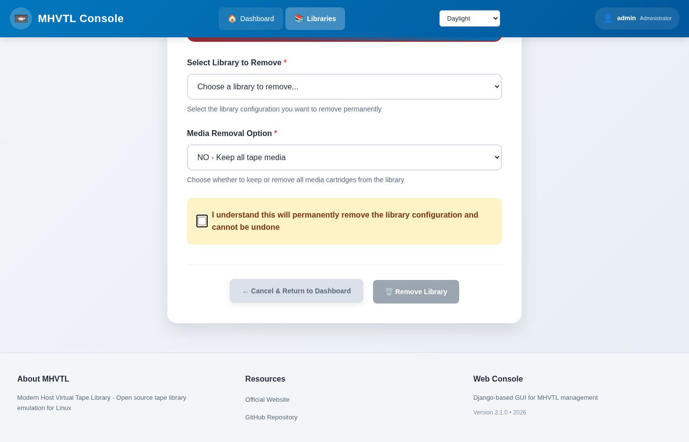

Removing a library
==================

Removing a library takes it out of ``device.conf``, stops its daemons, and
leaves its tapes on disk unless you ask for them to be deleted too.

.. contents::
   :local:
   :depth: 1

Before you do
-------------

**Is anything using it?** A library exported over iSCSI may be mounted by
another machine. Remove the export first (:doc:`../using/iscsi`), or that
machine keeps a target that points at nothing.

**Is a tape in a drive?** Removal refuses while a drive holds one - put it
back in its slot first, or pass ``--force``.

**Do you want the tapes?** By default they stay on disk, and can be put into
another library later with ``tape adopt`` (:doc:`../tapes/adopt`). That is
usually what you want: they are data.

In the console
--------------

The **Remove** button on the library page, or **Libraries → Remove**. You are
asked to confirm, and told what will happen to the tapes.

From the terminal
-----------------

.. code-block:: console

   $ sudo mhvtl library delete 50

   Library 50 deleted

   $ sudo mhvtl library delete 50 --remove-media

   Library 50 deleted (2 media file set(s) removed)

============================ ==================================================
Option                       What it does
============================ ==================================================
``--remove-media``           Delete the tape files too. Not reversible.
``--force``                  Delete even with a tape loaded in a drive
============================ ==================================================

What is left behind
-------------------

Without ``--remove-media``, the tape directories stay under ``/opt/mhvtl``
and no library lists them. They are *orphans*, and the console knows it:

.. code-block:: console

   $ sudo mhvtl library orphans

   Tapes on disk no library lists (data kept):
   BARCODE   PATH
   --------  -------------------
   K50005L8  /opt/mhvtl/K50005L8

   Put one back with: mhvtl tape adopt <library> <barcode>

Orphans are never cleaned up automatically, because they are data. To take
one back into a library, see :doc:`../tapes/adopt`.

``--clean`` removes what it finds, and asks first:

.. code-block:: console

   $ sudo mhvtl library orphans --clean

A library id can be reused immediately; nothing remembers it was taken.
