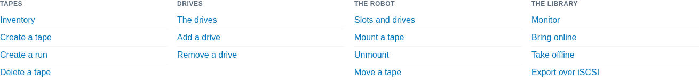
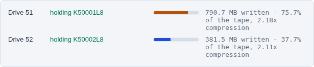

The library page
================

One library, and everything that can be done to it. If you are working on a
library, this is the page to be on.

Open it from **Libraries** in the header and click a library, or go straight
to ``/libraries/detail/<id>/``.

.. image:: ../_static/shots/library-page.png
   :alt: The library page for library 50
   :width: 100%

.. contents::
   :local:
   :depth: 1

What is on it
-------------

**Library Overview**
   What the library is - its id, vendor and model - and the buttons that act
   on the whole of it: Tapes, Monitor, Sync, Refresh, Stop and Remove.

**Capacity & Statistics**
   Slots, how many hold a tape, how many are free, how many drives, and when
   the console last read the configuration. The **Empty slots** box changes
   how many spare slots the library has; see :doc:`../tapes/create`.

**Manage this library**
   Fifteen links, in four groups - Tapes, Drives, The robot, The library.
   Each one carries the library with it, so the page it opens is already set
   to this one. This is the hub: you should rarely need to pick the library
   again once you are here.

**Tape Drives**
   What each drive is doing, refreshed every five seconds, then a card per
   drive with its SCSI address and serial. See :doc:`../using/watching`.

**Tapes**
   A tile per tape, with a bar for how full it is and how much room is left.

.. image:: ../_static/shots/tape-tiles.png
   :alt: Two tape tiles, each with a bar for how full the cartridge is
   :width: 100%

**Technical Specifications**
   The SCSI address, the serial, the NAA, and where MHVTL keeps this
   library's files. Useful when something else on the host disagrees with
   the console.

The same thing from the terminal
--------------------------------

There is no single command that prints the whole page, because the page
answers four questions. These are them:

.. code-block:: console

   $ sudo mhvtl library show 50          # what the library is
   $ sudo mhvtl status library 50        # what the robot says is where
   $ sudo mhvtl status activity 50       # what each drive is doing now
   $ sudo mhvtl tape list 50             # the tapes, with how full they are

``library show`` reads ``device.conf``; ``status library`` asks the robot
through ``mtx``; ``status activity`` asks the drive daemons directly. When
the first two disagree, the library was changed without being restarted -
the console says so on the page, and ``mhvtl`` says so on the command line.

The buttons, and what they run
------------------------------

============== =============================================================
Button         What it does
============== =============================================================
**Sync**       Reads the MHVTL configuration again and updates the console's
               record of it. Changes nothing on the host.
**Refresh**    Reloads the page.
**Stop**       Stops this library's daemons - the robot and its drives.
               The same as ``sudo mhvtl service stop --library 50``.
**Monitor**    Opens the monitor page: service state, drives online, slots,
               errors, and what the drives are doing.
**Remove**     Deletes the library from ``device.conf``. Its tapes are not
               deleted unless you ask for that. The same as
               ``sudo mhvtl library delete 50``; read :doc:`remove` first.
============== =============================================================

If the page says 404
--------------------

A library created from the command line exists in ``device.conf`` before the
console's database has heard of it. Opening the page syncs it first, so this
should not happen; if it does, press **Sync** on the library list, or check
that the library is really there:

.. code-block:: console

   $ sudo mhvtl library list

If it is in that list and the page still refuses, the console cannot read
``/etc/mhvtl``. It runs as the user ``mhvtl-gui`` in the group ``mhvtl``;
check that it can read the directory:

.. code-block:: console

   $ sudo -u mhvtl-gui ls /etc/mhvtl

If that fails - reinstalling MHVTL can reset the directory's owner - give it
back the group the package set when it was installed:

.. code-block:: console

   $ sudo chown -R root:mhvtl /etc/mhvtl
   $ sudo chmod 775 /etc/mhvtl
   $ sudo chmod 664 /etc/mhvtl/*
