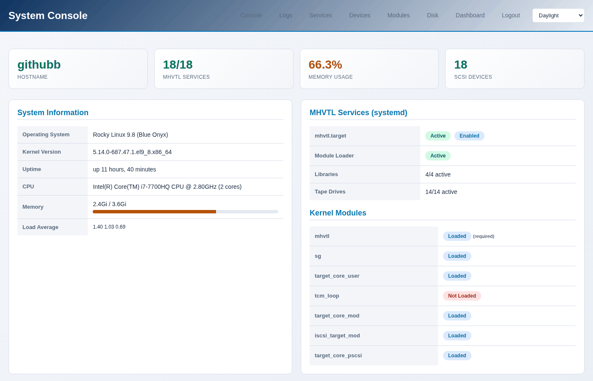
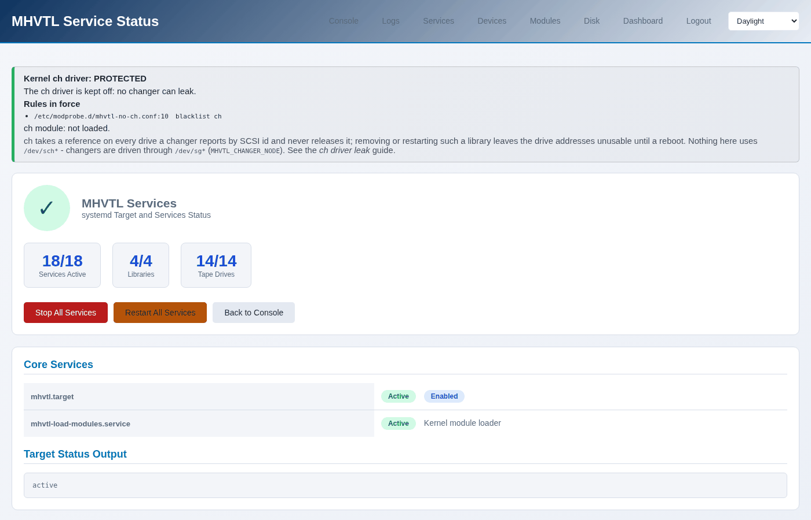
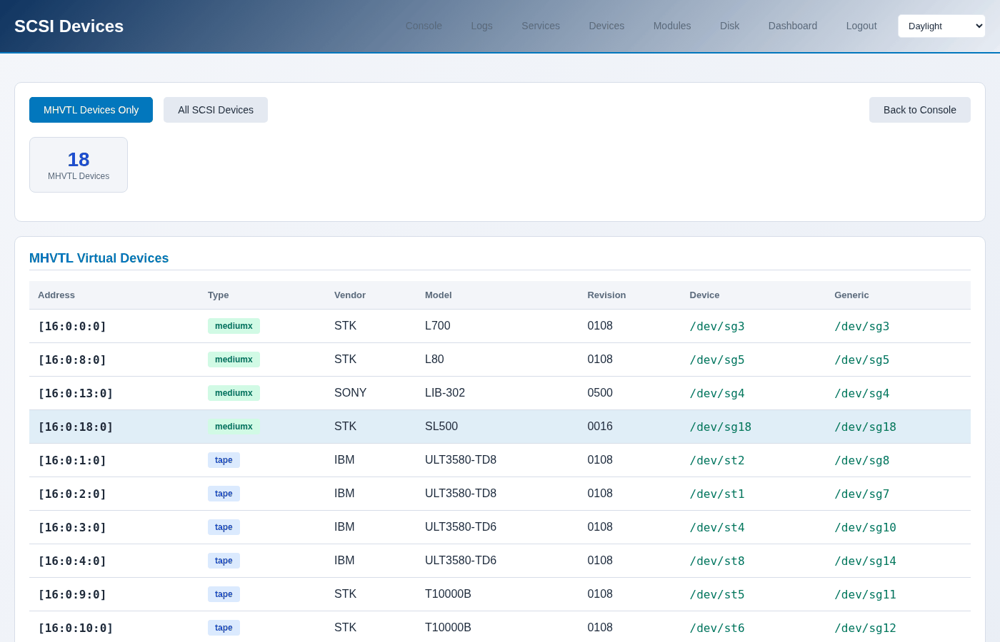
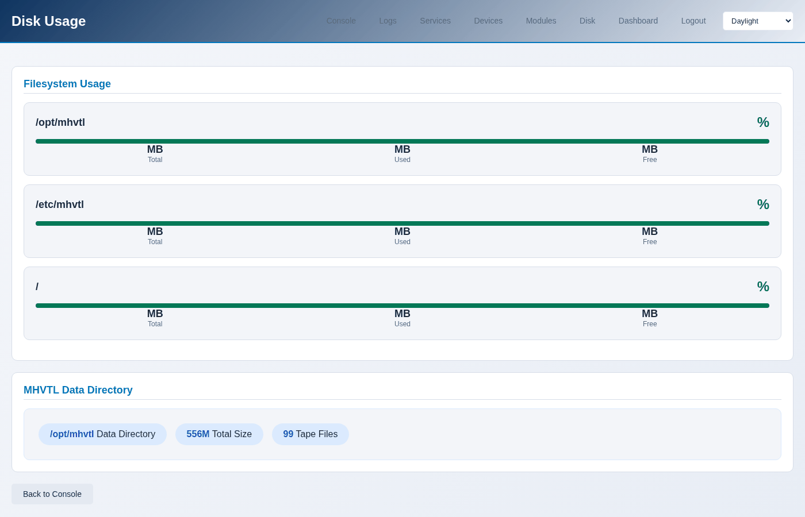

The system console
==================

Six pages about the host rather than about the libraries: what is running,
what the kernel sees, what is in the logs, and whether the disk is filling
up. This is where to look when a library misbehaves and the library pages
look fine.

.. contents::
   :local:
   :depth: 1

Console
-------

``/libraries/console/`` - the summary: the host, the MHVTL services, the
kernel modules, and how many SCSI devices there are.

.. code-block:: console

   $ sudo mhvtl console system

   hostname        githubb
   kernel          5.14.0-687.47.1.el9_8.x86_64
   distribution    Rocky Linux 9.8 (Blue Onyx)
   cpu model       Intel(R) Core(TM) i7-7700HQ CPU @ 2.80GHz
   cpu count       2
   uptime          up 12 hours, 22 minutes
   load average    0.36 0.23 0.26
   memory total    3.6Gi
   memory used     2.0Gi
   memory percent  56.1

Services
--------

Every MHVTL unit: the target, one daemon per library, one per drive.

.. code-block:: console

   $ sudo mhvtl status system

   reading       /etc/mhvtl/
   mhvtl.target  running
   enabled       yes
   backend       mhvtl
   libraries     4/4 running
   drives        13/14 running
   healthy       no

``healthy no`` with a count short of the total means a daemon is down. The
page names which, and so does ``systemctl``:

.. code-block:: console

   $ systemctl --failed 'vtl*'
   $ sudo systemctl start vtltape@52.service

Devices
-------

What the kernel sees, which is the ground truth underneath everything MHVTL
claims.

.. code-block:: console

   $ sudo mhvtl scsi devices

   ADDRESS      TYPE     VENDOR  MODEL        DEVICE     GENERIC
   -----------  -------  ------  -----------  ---------  ---------
   [16:0:0:0]   mediumx  STK     L700         /dev/sg3   /dev/sg3
   [16:0:1:0]   tape     IBM     ULT3580-TD8  /dev/st2   /dev/sg8
   [16:0:2:0]   tape     IBM     ULT3580-TD8  /dev/st1   /dev/sg7

``mediumx`` is a robot, ``tape`` a drive. A changer has no ``/dev/st``, so
its generic node is the one everything uses.

To go the other way - from a library or drive id to its device:

.. code-block:: console

   $ sudo mhvtl scsi map

   KIND     ID  DEVICE
   -------  --  ---------
   library  10  /dev/sg3
   library  20  /dev/sg4
   library  30  /dev/sg5
   library  50  /dev/sg18
   drive    11  /dev/st2
   drive    12  /dev/st1

These numbers are not stable. They change when the MHVTL module reloads and
when a library is recreated, which is why anything that remembers a device -
an iSCSI export, for instance - has to be repointed afterwards. See
:doc:`../using/iscsi`.

Modules
-------

.. code-block:: console

   $ sudo mhvtl console modules

   backend: mhvtl
   MODULE             LOADED  REQUIRED
   -----------------  ------  --------
   mhvtl              yes     yes
   sg                 yes     no
   target_core_user   yes     no
   tcm_loop           no      no
   target_core_mod    yes     no
   iscsi_target_mod   yes     no
   target_core_pscsi  yes     no

Only ``mhvtl`` is required. The rest matter when exporting over iSCSI: LIO
loads what it needs, and a module that is missing shows up there as an export
that cannot be made.

The ``ch`` module is deliberately **not** in this list, and is blacklisted on
this host. It takes a reference on every drive a changer reports and never
gives it back, which makes those drives' SCSI addresses unusable until the
machine reboots. The guide *The kernel ch driver leak* explains it.

Logs
----

An allowlisted set of logs, tailed - the console never reads an arbitrary
path off the disk.

.. code-block:: console

   $ sudo mhvtl console logs -n 20

   Sep 21 13:05:37 githubb /usr/bin/vtllibrary[853]: spc_inquiry(): INQUIRY ** (80717)
   Sep 21 13:05:37 githubb /usr/bin/vtllibrary[853]: CDB (80718) (delay 1205): 1a 08 1d 00 88 00
   Sep 21 13:05:37 githubb /usr/bin/vtllibrary[853]: spc_mode_sense(): MODE SENSE 6 (80718) **

MHVTL logs every SCSI command it is given, so this is verbose and useful in
equal measure: when a backup fails, the last few lines say what the drive was
asked to do and what it answered.

Disk
----

Tapes are files. When the disk fills, writes fail in ways that look like
drive faults.

.. code-block:: console

   $ sudo mhvtl console disk

   PATH        SIZE  USED  FREE  USED %
   ----------  ----  ----  ----  ------
   /opt/mhvtl  62G   38G   25G   62
   /etc/mhvtl  62G   38G   25G   62
   /           62G   38G   25G   62

``/opt/mhvtl`` holds the cartridges, ``/etc/mhvtl`` the configuration. A
cartridge only occupies what has been written to it, not the size it was
created with - so a library of ten 500 GB tapes does not need five terabytes
until somebody writes that much.

