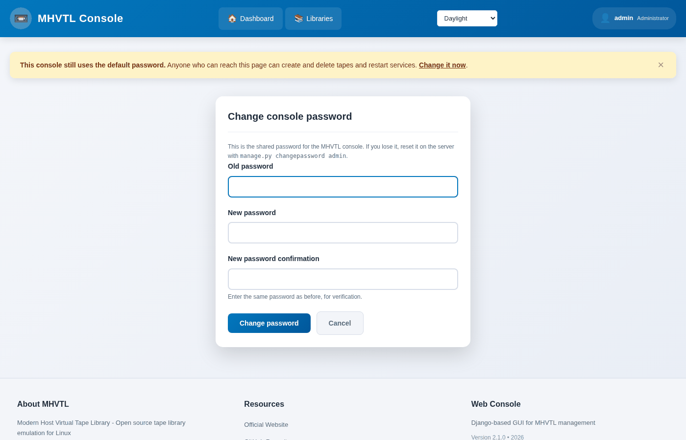
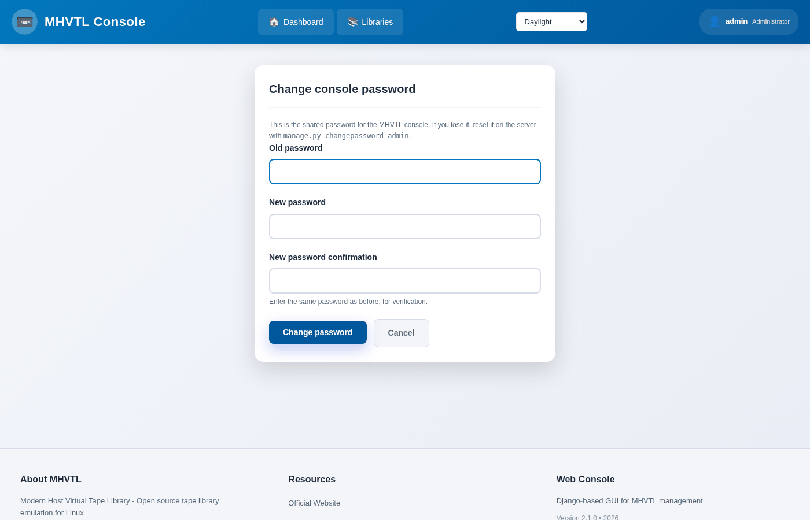

The password, and who can reach this
====================================

One password for the whole console. Anyone who can reach the page and knows
it can create and delete tapes, stop libraries and restart services.

.. contents::
   :local:
   :depth: 1

The warning
-----------

While the console still answers to the password it shipped with - ``mhvtl`` -
every page carries a band saying so:

The **×** on the right puts it away, and that is remembered in your browser.
It is a reminder, not a lock: dismissing it changes nothing about the
password, and another browser still sees it.

Changing it
-----------

**Change it now** in the warning, or the **Password** link, at
``/auth/password/``.

Three fields - the password you have, the new one twice. On success the
console returns to the dashboard, you stay logged in, and the warning is
gone from every page, in every browser, because the server stops sending it.

The old password stops working at once. Logging in with it answers *Wrong
Password, Please Try Again*.

If you lose it
--------------

There is no reset link - there is no email address to send one to. Change it
on the server instead:

.. code-block:: console

   $ cd /opt/mhvtl-gui
   $ sudo -u mhvtl-gui ./venv/bin/python manage.py changepassword admin

Django asks for the new one twice and writes it to the console's database.

Who can reach the console
-------------------------

The password is the only thing between a visitor and every library on this
host, so it matters where the console listens:

- The service itself binds ``127.0.0.1:8000`` - not reachable from another
  machine at all.
- nginx serves it on **443** over HTTPS, and redirects **80** to that. On a
  host where those ports are taken it will be somewhere else - 8443 and 8080
  are the usual alternative.
- The certificate the installer creates is self-signed, so a browser asks
  about it once. Replace ``/etc/pki/tls/certs/mhvtl-gui.crt`` and its key
  with your own if you have one.

``ALLOWED_HOSTS`` in ``/etc/mhvtl-gui/env`` decides which names the console
answers to. A request with any other ``Host`` header is refused, which is
what stops a machine elsewhere pointing a DNS name at yours.

What the password does not cover
--------------------------------

**The command line.** ``mhvtl`` reads the configuration directly and writes
through sudo; it has nothing to do with the console's password. Anyone with
shell access and the sudo rules can do everything the console can, and more.

**iSCSI.** An exported library is reachable by anything that can open port
3260, unless the export has an access list or CHAP. Exporting with
``--initiator`` limits it to one client; the *iSCSI* guides cover CHAP.

This console is built for one administrator on a machine they control. It is
not multi-user: there are no accounts, no roles, and no audit of who did
what.
