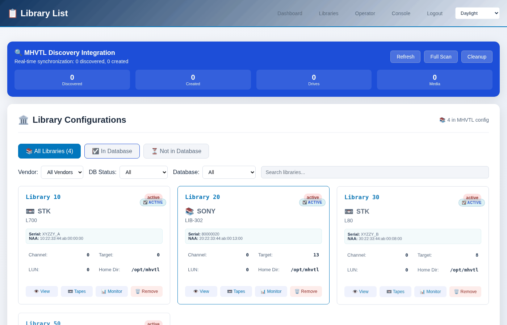

A first look
============

This walks through opening the console for the first time and checking that
MHVTL underneath it is running. Installing it is in the *Guides* -
*Installation*.

.. contents::
   :local:
   :depth: 1

Log in
------

Open ``https://your-server/``. The certificate the installer creates is
self-signed, so a browser asks about it once.

There is one password for the whole console, and it starts as ``mhvtl``.
While it is still that, every page carries a warning saying so, with a link
that changes it. See :doc:`../running/password`.

``http://your-server/`` redirects to the HTTPS address.

.. note::

   If something else on the host already uses port 80 or 443 - another web
   application, a reverse proxy - the installer's nginx configuration will
   not start beside it, and whoever installed it will have moved the console
   to another port, usually 8443 with 8080 redirecting. Then the address is
   ``https://your-server:8443/``. *Installation* in the *Guides* has the
   two lines to change.

Is MHVTL running?
-----------------

The console is a window onto MHVTL, so if MHVTL is not running there is
nothing to see. **Console → Services** answers it:

.. code-block:: console

   $ sudo mhvtl status system

   mhvtl.target     active, enabled
   modules          mhvtl loaded
   libraries        3/3 running
   drives           12/12 running

If the target is not active:

.. code-block:: console

   $ sudo systemctl start mhvtl.target

What you see first
------------------

**Dashboard** is the overview: how many libraries, how many are running,
what the host is.

.. image:: ../_static/shots/dashboard.png
   :alt: The dashboard: libraries, their state, and the host
   :width: 100%

**Libraries** lists every library MHVTL has, read from its configuration
rather than from the console's own records - so a library somebody created
from the command line a minute ago is in the list.

Click one and you are on :doc:`../libraries/the-library-page`, which is where
most work happens.

The same thing from the terminal
--------------------------------

.. code-block:: console

   $ sudo mhvtl library list

   ID  MODEL         SERIAL    DRIVES  SLOTS  TAPES
   --  ------------  --------  ------  -----  -----
   10  STK L700      XYZZY_A   4       39     32
   20  SONY LIB-302  80000020  4       40     25
   30  STK L80       XYZZY_B   4       40     40

``mhvtl`` reads the same configuration the console does and needs no web
server running. Everything in this guide can be done either way; each page
shows both.

If there are no libraries yet
-----------------------------

That is the ordinary state after installing. Go to
:doc:`../libraries/create`.
