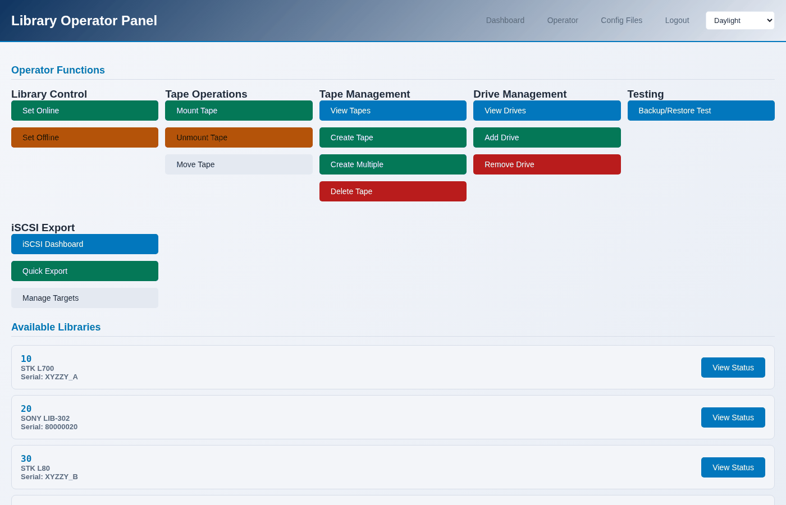

Finding your way around
=======================

Five places, and which one you want.

.. contents::
   :local:
   :depth: 1

The header
----------

Every page carries the same header: **Dashboard**, **Libraries**,
**Operator**, **Console**, **Logout**, and the theme picker.

Dashboard
---------

``/auth/dashboard/`` - the overview. How many libraries there are, how many
are running, what the host is, and links into everything else.

Libraries
---------

``/libraries/list/`` - every library, from MHVTL's own configuration. Each
card has its id, model, serial, and buttons for the things done most often.

Clicking one opens :doc:`../libraries/the-library-page`, which is the hub for
a single library: what it is, what its drives are doing, what tapes it holds,
and links to every action, with the library already chosen.

Operator
--------

``/libraries/operator/`` - the panel for tape work across libraries: mount,
unmount, move, create tapes, the inventory, add and remove drives, bring a
library online or offline.

Every page here has a library picker at the top. Arriving from a library page
sets it for you.

Console
-------

``/libraries/console/`` - the host rather than the libraries. Six pages:

============ ================================================================
Page         What it shows
============ ================================================================
**Console**  System facts, MHVTL services, kernel modules, SCSI device count
**Logs**     An allowlisted set of logs, tailed
**Services** Every MHVTL unit: the target, the libraries, the drives
**Devices**  What the kernel sees: changers and drives, with their /dev nodes
**Modules**  Kernel module state, including the ones iSCSI needs
**Disk**     Space where the configuration and the tape files live
============ ================================================================

See :doc:`../running/console`.

Themes
------

Four, from the picker in the header: Console Navy, Graphite, Daylight and
Sepia. The choice is remembered in your browser, and applies to every page.

Two of them are light and two are dark; nothing else changes.

The command line
----------------

``mhvtl`` covers the same ground, arranged as nouns and verbs:

============= ===============================================================
Noun          What it is for
============= ===============================================================
``library``   list, show, create, delete, slots, orphans, next-id
``drive``     list, show, add, remove
``tape``      list, media, slots, create, bulk, adopt, delete, next-barcode
``status``    library, drive, activity, system, dashboard
``service``   start, stop, restart, status
``iscsi``     status, targets, export, target, lun, acl, portal, remap
``config``    list, show, validate, export, backup, restore, sync
``console``   logs, modules, disk, system
``scsi``      devices, map
============= ===============================================================

Every command takes ``--json`` for a machine-readable answer, and ``--help``
at any level:

.. code-block:: console

   $ sudo mhvtl tape --help
   $ sudo mhvtl tape create --help
