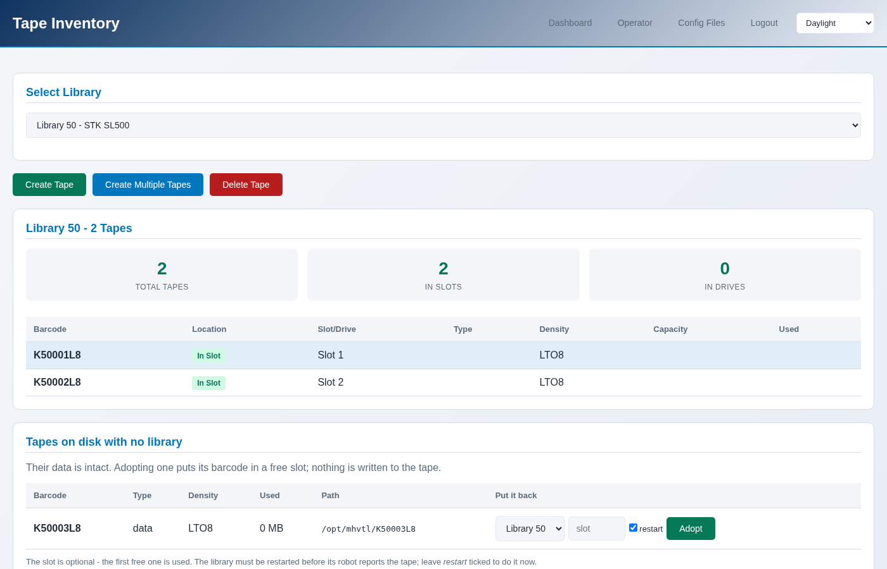

Adopting a tape that is already on disk
=======================================

A tape's data outlives the library that held it. Removing a library leaves
its cartridges under ``/opt/mhvtl``, and *adopting* one puts it into a
library again, with everything that was written to it.

.. contents::
   :local:
   :depth: 1

When this comes up
------------------

- A library was removed without ``--remove-media`` - the usual case.
- A library was rebuilt, because MHVTL reads its vendor and model once and
  changing them means recreating it.
- Tape files were copied from another host.

Finding them
------------

.. code-block:: console

   $ sudo mhvtl library orphans

   Tapes on disk no library lists (data kept):
   BARCODE   PATH
   --------  -------------------
   K50005L8  /opt/mhvtl/K50005L8

   Put one back with: mhvtl tape adopt <library> <barcode>

Orphaned tapes are listed apart from everything else the console considers
orphaned, and are never cleaned up automatically. They are data.

Adopting one
------------

**Tapes → Inventory**, then **Adopt**, or on the operator's tape pages. The
list offers the tapes on disk that no library lists, and the libraries whose
drives can read that generation.

.. code-block:: console

   $ sudo mhvtl tape adopt 50 K50005L8
   K50005L8 is now in slot 5 of library 50, with its data
   Restart the library for its robot to see this: mhvtl service restart --library 50

   $ sudo mhvtl tape adopt 50 K50005L8 --slot 4

What it does, and what it does not
----------------------------------

It adds the cartridge to ``library_contents.50`` and leaves its files exactly
where they are. Nothing is copied, nothing is rewritten, and the data is not
read.

The library must have a free slot, and its drives must take that generation -
an LTO-8 cartridge cannot be adopted into a library of AIT drives, because
nothing there could ever load it.

Restart the library afterwards
------------------------------

MHVTL reads ``library_contents`` once, when the library starts, so its robot
does not see the adopted tape until it restarts:

.. code-block:: console

   $ sudo mhvtl service restart --library 50

Both the console and the command line say this after an adopt, and the
library page flags a library whose configuration and robot disagree.

Checking the data survived
--------------------------

Mount it and ask the drive:

.. code-block:: console

   $ sudo mhvtl op mount 50 3 0
   $ sudo mhvtl status activity 50

   DRIVE  STATE    BARCODE   COUNTERS
   -----  -------  --------  ------------------------------------------
   51     holding  K50001L8  363.0 MB written - 75.7% of the tape

A tape that kept its data reports what was written to it. One that lost its
files reports an empty cartridge - and ``mhvtl tape list`` would have said
``ON DISK: no`` before you mounted it.
