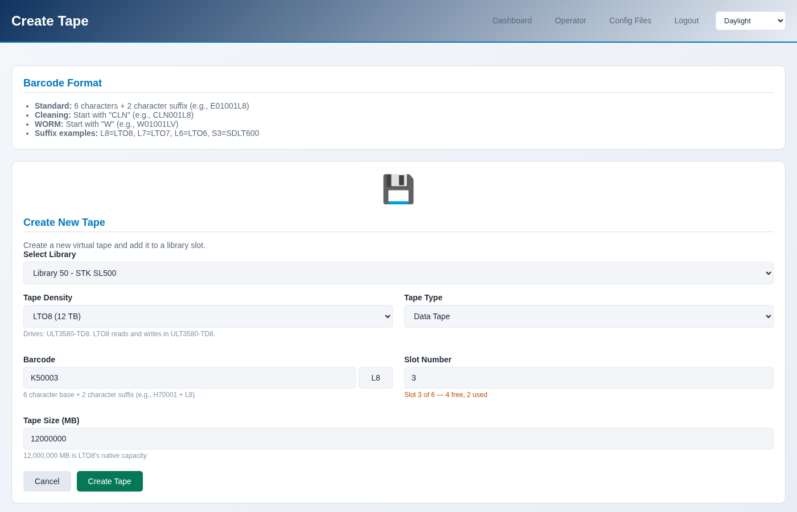

Creating tapes
==============

A tape is a barcode, a size, and a generation. Creating one writes its files
under ``/opt/mhvtl`` and puts it in a free slot of a library.

.. contents::
   :local:
   :depth: 1

The barcode decides the generation
----------------------------------

A barcode is a prefix, a number and a two-character suffix: ``K50001L8`` is
``K50`` + ``001`` + ``L8``. The suffix is not decoration - it is how MHVTL
knows what the cartridge is, and therefore which drives can load it.

``L5`` to ``L9``
   LTO-5 to LTO-9

``LA``
   LTO-10

``JC``, ``JD``
   IBM 3592

``S3``
   T10000

Which ones this library's drives take:

.. code-block:: console

   $ sudo mhvtl tape media 50

   Drives: ULT3580-TD8, ULT3580-TD8
   DENSITY  SUFFIX  USE         IN DRIVES
   -------  ------  ----------  -----------
   LTO8     L8      read/write  ULT3580-TD8
   LTO7     L7      read/write  ULT3580-TD8

   Default for new tapes: LTO8

A drive reads older generations and writes recent ones, exactly as the real
hardware does. Making an LTO-5 cartridge for an LTO-8 drive is allowed -
that drive can read it - but nothing will write to it.

One tape
--------

**Operator → Create Tape**, or **Tapes → Create a tape** on the library page.

The form proposes the next free barcode in the series this library already
uses, so tapes stay in one run rather than becoming a scatter of prefixes.

.. code-block:: console

   $ sudo mhvtl tape next-barcode 50
   K50003L8

   $ sudo mhvtl tape create 50 K50003L8
   Created K50003L8 in slot 3 of library 50
   Restart the library for its robot to see this: mhvtl service restart --library 50

=================== ==========================================================
Option              What it does
=================== ==========================================================
``--slot``          Which slot to put it in; the first free one if omitted
``--size-mb``       Capacity in MB. The default is large; a small tape is
                    better for testing, because filling it is the interesting
                    part
``--density``       LTO8, LTO7 … read from the barcode suffix if omitted
``--kind``          ``data`` (the default), ``clean`` or ``WORM``
=================== ==========================================================

A run of tapes
--------------

**Tapes → Create a run** makes several at once, numbered in sequence.

.. code-block:: console

   $ sudo mhvtl tape bulk 50 10 --prefix K50 --suffix L8 --start 3
   Created 10 of 10 tapes in library 50
   Restart the library for its robot to see this: mhvtl service restart --library 50

The count stops at the free slots: a library with four empty slots takes four
tapes. Add more room first if you need it (see below).

Size, and why it matters
------------------------

The default size is large enough that nothing fills it, which is right for
using a library and wrong for watching one. A tape the size of what you are
about to write shows the interesting part - the drive reporting how full it
is, the bar filling up, the end of tape.

.. code-block:: console

   $ sudo mhvtl tape create 50 K50004L8 --size-mb 480

Room for more tapes
-------------------

A library has a fixed number of slots, and only the empty ones can take a new
tape. **Empty slots** on the library page changes that, and so does:

.. code-block:: console

   $ sudo mhvtl tape slots 50

   total slots     6
   full slots      2
   empty slots     4
   map slots       4
   drives          2
   cleaning tapes  0

   $ sudo mhvtl library slots 50 --add 4 --restart
   $ sudo mhvtl library slots 50 --empty 10 --restart

Adding slots edits ``library_contents.50``, which MHVTL reads once when the
library starts - so the robot does not see the new slots until it restarts.
``--restart`` does that for you; without it, the console and the command line
both say the restart is owed.

Shrinking only removes empty slots after the last tape; it never removes a
slot holding one.

Deleting a tape
---------------

.. code-block:: console

   $ sudo mhvtl tape delete 50 K50003L8
   Its media files are kept; `mhvtl tape adopt <library> K50003L8` puts it back.
   Removed K50003L8 from slot 3

   $ sudo mhvtl tape delete 50 K50003L8 --remove-media    # and off the disk

Without ``--remove-media`` the files stay on disk and the tape becomes an
orphan, which can be put back later - see :doc:`adopt`. With it, the data is
gone.
