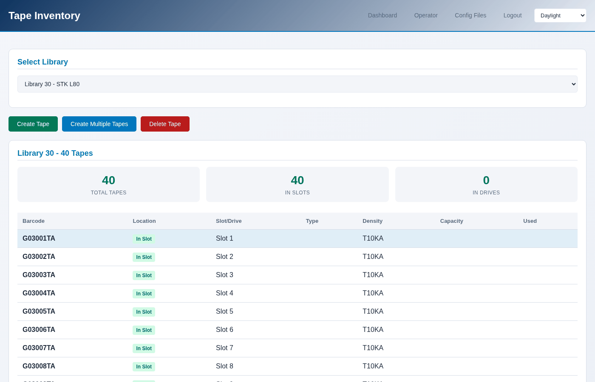

The tape inventory
==================

Every tape a library holds, what is in each one, and how full it is.

.. contents::
   :local:
   :depth: 1

In the console
--------------

**Tapes → Inventory** on the library page, or **Operator → Tapes**, at
``/libraries/operator/tapes/``.

The library page shows the same tapes as tiles, which is the quickest way to
see whether anything is filling up: a bar per tape, and how much room is
left under it. The bar is blue while there is room, amber past 75%, and red
past 90%.

.. image:: ../_static/shots/tape-tiles.png
   :alt: Two tape tiles: one three-quarters full in amber, one empty
   :width: 100%

From the terminal
-----------------

.. code-block:: console

   $ sudo mhvtl tape list 50

   BARCODE   SLOT  KIND  DENSITY  USED MB  CAPACITY MB  ON DISK
   --------  ----  ----  -------  -------  -----------  -------
   K50001L8  1     data  LTO8     363      480          yes
   K50002L8  2     data  LTO8     0        480          yes

   2 tapes, 4 empty slots

=============== ==============================================================
Column          What it means
=============== ==============================================================
**SLOT**        Where the cartridge sits. A tape in a drive shows the drive
**KIND**        ``data``, ``clean`` or ``WORM``, from the barcode
**DENSITY**     The generation, from the barcode suffix
**USED MB**     How much of it has been written - the size of its files
**CAPACITY MB** How big it was made
**ON DISK**     Whether its files are really there. ``no`` means the library
                lists a tape whose files are gone
=============== ==============================================================

Where the numbers come from
---------------------------

**Used** is the size of the tape's data files under ``/opt/mhvtl/<barcode>/``.
It is what is really on the disk, which is what matters when the disk fills
up.

**Capacity** is read from the cartridge's own MAM file - the medium auxiliary
memory, which a real cartridge also has. That is why a tape sitting in a slot
has a size at all: nothing needs to load it to ask.

A tape in a drive has a second, better answer: the drive itself, which is
live while a backup runs. The two disagree during a write - the MAM is only
written back when the tape is unloaded - and the drive is right. See
:doc:`../using/watching`.

Compression
-----------

MHVTL compresses what it writes, so a tape holds more than its size in data:
600 MB of ordinary files takes about 285 MB of a cartridge. The drive reports
the ratio while it writes, and the tape's *used* figure is the compressed
size, because that is what occupies the disk.

Tapes that are not in a library
-------------------------------

A tape whose library was removed still has its files. It appears in no
inventory, because no library lists it:

.. code-block:: console

   $ sudo mhvtl library orphans

See :doc:`adopt` for putting one back.
