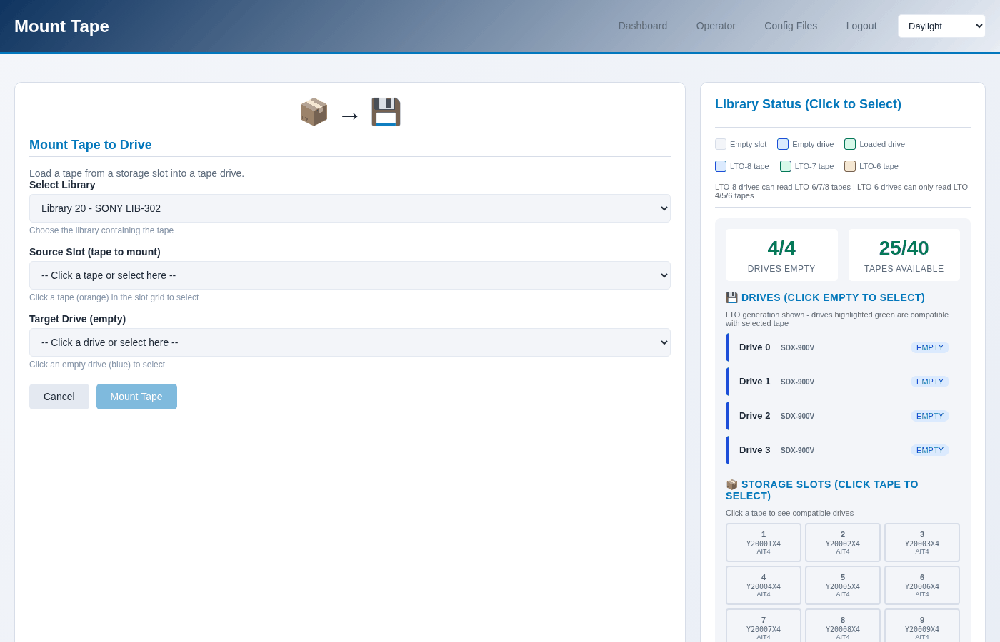
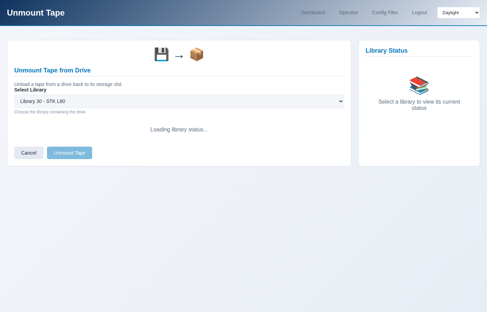

Moving a tape: mount, unmount, move
===================================

The robot does three things: put a cartridge in a drive, take it out again,
and move it between slots. Everything else is the drive's job.

.. contents::
   :local:
   :depth: 1

Mount: slot into drive
----------------------

**Operator → Mount Tape**, or **The robot → Mount a tape** on the library
page.

Pick the library, the slot and the drive. The page shows what is in each
slot, coloured by generation, so an LTO-7 cartridge is not mounted into a
drive that cannot write it by accident.

.. code-block:: console

   $ sudo mhvtl op mount 50 1 0
   Mounted K50001L8 from slot 1 into drive 0

The drive number is the robot's, counting from 0 - the first drive in the
library is 0, not its drive id. ``mhvtl status library 50`` shows both.

A drive that does not load that generation refuses, which is the point.
``--force`` overrides it if you are testing what the refusal looks like.

Unmount: drive back to a slot
-----------------------------

.. code-block:: console

   $ sudo mhvtl op unmount 50 0              # back where it came from
   $ sudo mhvtl op unmount 50 0 --slot 4     # to a particular slot

A tape goes back to the slot it came from unless you say otherwise. If that
slot has since been filled, name a free one.

Move: slot to slot
------------------

.. code-block:: console

   $ sudo mhvtl op move 50 1 5

Tidying, mostly: putting a run of tapes in order, or clearing a slot for a
cartridge that has to live somewhere particular.

Online and offline
------------------

A library can be told to stop answering the robot without stopping its
daemons:

.. code-block:: console

   $ sudo mhvtl op offline 50
   $ sudo mhvtl op online 50

Offline is refused while a drive holds a tape, which is MHVTL's own rule, not
this console's.

The MAP
-------

The mail slot, where an operator at a real library puts a cartridge in from
outside. MHVTL emulates it, and the console can open it, close it, and have
the robot re-read it:

.. code-block:: console

   $ sudo mhvtl op map 50 --help

What the robot says is where
----------------------------

.. code-block:: console

   $ sudo mhvtl status library 50

   Library 50: 2/6 slots full, 1/2 drives loaded

   Drives:
   DRIVE  LOADED  BARCODE   FROM SLOT
   -----  ------  --------  ---------
   0      yes     K50001L8  1
   1      no      -         -

   Slots holding a tape (1):
   SLOT  BARCODE
   ----  --------
   2     K50002L8

This is the robot's own answer, through ``mtx``. When it disagrees with
``mhvtl tape list``, the library was changed without being restarted - the
configuration says one thing and the running robot another.
