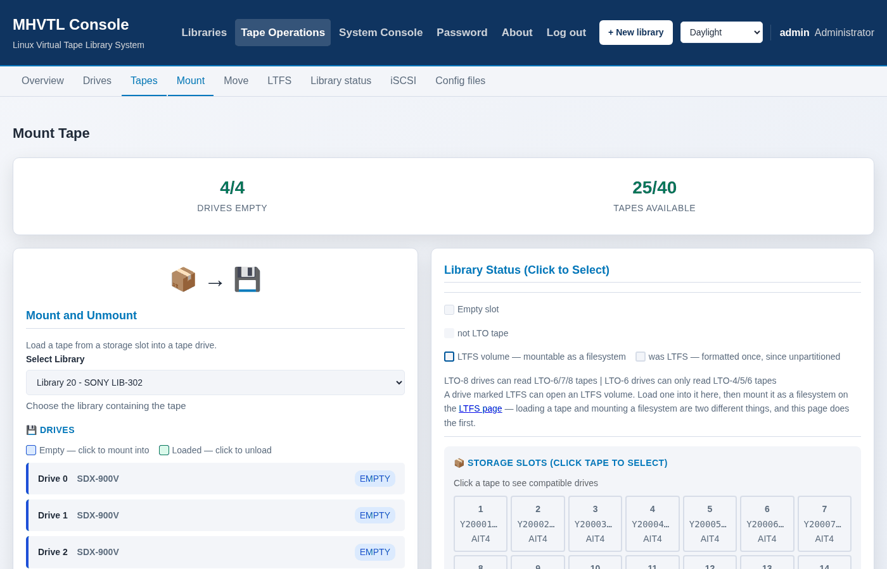

Moving a tape: mount, unmount, move
===================================

The robot does three things: put a cartridge in a drive, take it out again,
and move it between slots. Everything else is the drive's job.

.. contents::
   :local:
   :depth: 1

One page does the first two
---------------------------

**Operator → Mount / Unmount Tape**, or **The robot → Mount or unmount a
tape** on the library page. There used to be two pages; the drives were drawn
on both and clickable on neither.

Which direction you are going depends on which drive you click:

.. list-table::
   :header-rows: 1
   :widths: 40 60

   * - Click
     - What happens
   * - a tape, then an **empty** drive
     - mount - the tape goes into the drive
   * - a **loaded** drive
     - unmount - its cartridge goes back to a slot

A click only ever *selects*. The preview says what will happen and the button
does it, both ways round.

Mount: slot into drive
----------------------

Pick the library, the slot and the drive. The page shows what is in each
slot, coloured by generation, so an LTO-7 cartridge is not mounted into a
drive that cannot write it by accident.

.. code-block:: console

   $ sudo mhvtl op mount 50 1 0
   Mounted K50001L8 from slot 1 into drive 0

The drive number is the robot's, counting from 0 - the first drive in the
library is 0, not its drive id. ``mhvtl status library 50`` shows both.

A drive that does not load that generation refuses, which is the point.
``--force`` overrides it if you are testing what the refusal looks like.

Unmount: drive back to a slot
-----------------------------

Click a loaded drive. The slot it came from is chosen for you and outlined on
the map; click any empty slot, or use the dropdown, to send it somewhere else.

If that original slot has since been filled there is no default, the page says
so, and the button waits until you choose a free one. Being told "slot 7" and
finding slot 7 occupied is worse than being told nothing.

.. code-block:: console

   $ sudo mhvtl op unmount 50 0              # back where it came from
   $ sudo mhvtl op unmount 50 0 --slot 4     # to a particular slot

.. important::

   **A drive whose cartridge is mounted as an LTFS filesystem cannot be
   unloaded**, from the page or the command line. It is not a warning: pulling
   the cartridge out from under a live mount leaves ``ltfs`` holding a device
   with no medium, and whatever was reading it gets I/O errors rather than a
   clean end.

   Unmount the filesystem first - the LTFS page, or
   ``mhvtl ltfs unmount <library> <drive>`` - and then unload the tape. Such a
   drive is marked on the map and is not offered in the list.

   The two senses of "mount" are the thing to keep straight: this page moves a
   cartridge **into** a drive, and the LTFS page opens what is **in** a drive
   as a filesystem.

The old ``/libraries/operator/unmount/`` address still works and sends you
here, carrying the library with it.

Move: slot to slot
------------------

.. code-block:: console

   $ sudo mhvtl op move 50 1 5

Tidying, mostly: putting a run of tapes in order, or clearing a slot for a
cartridge that has to live somewhere particular.

Online and offline
------------------

A library can be told to stop answering the robot without stopping its
daemons:

.. code-block:: console

   $ sudo mhvtl op offline 50
   $ sudo mhvtl op online 50

Offline is refused while a drive holds a tape, which is MHVTL's own rule, not
this console's.

The MAP
-------

The mail slot, where an operator at a real library puts a cartridge in from
outside. MHVTL emulates it, and the console can open it, close it, and have
the robot re-read it:

.. code-block:: console

   $ sudo mhvtl op map 50 --help

Seeing the whole library at once
---------------------------------

``op layout`` draws it: every drive with what it holds, the storage slots as a
grid, the import/export port, and a legend of the generations this library
actually has.

.. code-block:: console

   $ mhvtl op layout 10

   Drives
     Drive 0   ULT3580-TD8    empty  takes up to LTO-8
     Drive 2   ULT3580-TD6    empty  takes up to LTO-6

   Storage slots  (32 of 39 full)
     1 [ E01001L8 ]   2 [ E01002L8 ]   3 [ E01003L8 ]   ...

   Legend  LTO-6  LTO-8

Each cartridge is coloured by its generation, in the same colours the web
pages use - the real LTO cartridge shell colours, adjusted so that generations
sharing one in real life can still be told apart. ``mhvtl op palette`` prints
them all with their meanings.

Colour is never the only thing saying what a tape is: the generation is always
written out beside it, so a pipe, ``--no-colour``, or a terminal without 256
colours loses nothing but the fill.

``--ltfs`` marks which cartridges are LTFS volumes - see :doc:`../using/ltfs`.

What the robot says is where
----------------------------

.. code-block:: console

   $ sudo mhvtl status library 50

   Library 50: 2/6 slots full, 1/2 drives loaded

   Drives:
   DRIVE  LOADED  BARCODE   FROM SLOT
   -----  ------  --------  ---------
   0      yes     K50001L8  1
   1      no      -         -

   Slots holding a tape (1):
   SLOT  BARCODE
   ----  --------
   2     K50002L8

This is the robot's own answer, through ``mtx``. When it disagrees with
``mhvtl tape list``, the library was changed without being restarted - the
configuration says one thing and the running robot another.
