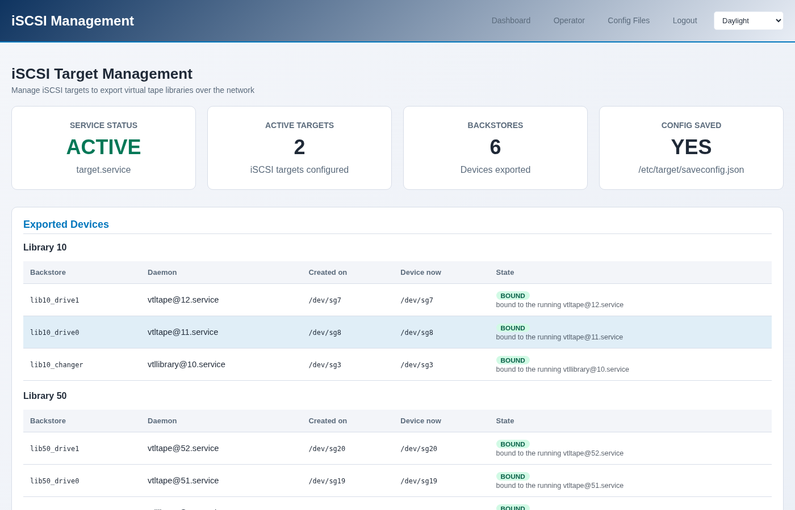
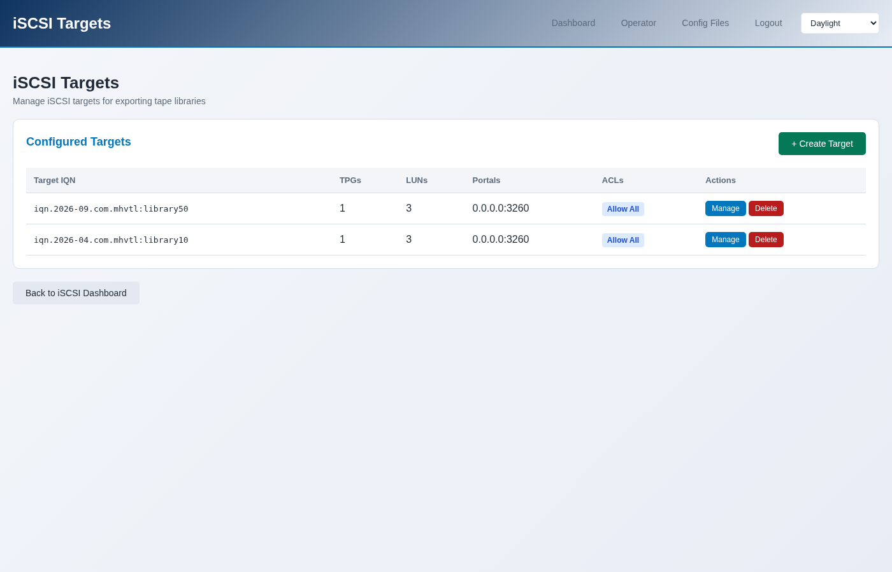

Exporting a library over iSCSI
==============================

Exporting makes a library visible to another machine, which then sees a tape
library on its own SCSI bus and backs up to it as if it were plugged in.

.. contents::
   :local:
   :depth: 1

What gets exported
------------------

Three devices per library, at least: the robot, and each drive. Backup
software needs all of them - the robot to move cartridges, the drives to
write.

.. code-block:: console

   $ sudo mhvtl iscsi export 50
   Library 50 exported as iqn.2026-09.com.mhvtl:library50: 3 LUN(s)

That is library 50, which has two drives: one changer and two drives make
three LUNs.

In the console it is **iSCSI → Export Library**, or **The library → Export
over iSCSI** on the library page.

What it made
------------

.. code-block:: console

   $ sudo mhvtl iscsi targets

   IQN                              TPG  LUNS  ACLS  ANY INITIATOR
   -------------------------------  ---  ----  ----  -------------
   iqn.2026-09.com.mhvtl:library50  1    3     0     yes
   iqn.2026-04.com.mhvtl:library10  1    3     0     yes

   $ sudo mhvtl iscsi backstores

   NAME           PLUGIN  DEVICE PATH
   -------------  ------  -----------
   lib50_drive1   pscsi   /dev/sg20
   lib50_drive0   pscsi   /dev/sg19
   lib50_changer  pscsi   /dev/sg18

**IQN** is the target's name, which the other machine uses to find it.

**ANY INITIATOR** means no access list: anything that can reach the port may
use it. To restrict it, export with ``--initiator``, or add an ACL:

.. code-block:: console

   $ sudo mhvtl iscsi export 50 --initiator iqn.1994-05.com.redhat:client1

Connecting from another machine
-------------------------------

On the client, with ``iscsi-initiator-utils`` installed:

.. code-block:: console

   # discover what this host offers
   $ sudo iscsiadm -m discovery -t sendtargets -p mhvtl-host:3260

   # log in to the library
   $ sudo iscsiadm -m node -T iqn.2026-09.com.mhvtl:library50 \
        -p mhvtl-host:3260 --login

   # it is now a changer and two drives on this machine
   $ lsscsi -g | grep -E "mediumx|tape"

From there it is an ordinary tape library: ``mtx`` drives the robot, ``mt``
and ``tar`` the drives. The tutorial *Exporting a library with Linux tools*
in the *Guides* walks through a full backup and restore across the wire.

After a reboot, or after recreating a library
---------------------------------------------

An export names devices by their ``/dev/sg`` node, and those numbers are not
stable: they change when the MHVTL module reloads, and when a library is
recreated. An export pointing at the wrong node is worse than one that is
missing.

The console keeps a record of which daemon each backstore was made for, and
repoints them by SCSI address:

.. code-block:: console

   $ sudo mhvtl iscsi remap

   BACKSTORE      SAVED      NOW        WHY
   -------------  ---------  ---------  ---------------
   lib50_drive1   /dev/sg20  /dev/sg20  already correct
   lib50_drive0   /dev/sg19  /dev/sg19  already correct
   lib50_changer  /dev/sg18  /dev/sg18  already correct

The iSCSI page shows the same thing per device: **Created on** is the node
the backstore was made with, **Device now** is where that daemon actually is,
and **State** is ``BOUND`` when they agree. A stale one says so.

This runs automatically at boot, through ``mhvtl-iscsi-remap.service``.

Removing an export
------------------

.. code-block:: console

   $ sudo mhvtl iscsi target delete iqn.2026-09.com.mhvtl:library50
   Deleted target iqn.2026-09.com.mhvtl:library50

Log the client out first, or it keeps a session to a target that has gone.

The target goes; its **backstores stay**. They are the devices, and deleting
a target does not assume you meant to stop exporting them - the same devices
can be mapped into another target. ``mhvtl iscsi backstores`` still lists
them afterwards, and they are removed with targetcli:

.. code-block:: console

   $ sudo targetcli /backstores/pscsi delete lib50_changer
   $ sudo targetcli /backstores/pscsi delete lib50_drive0
   $ sudo targetcli /backstores/pscsi delete lib50_drive1
   $ sudo targetcli saveconfig

Is the service even running?
----------------------------

.. code-block:: console

   $ sudo mhvtl iscsi status

   target.service  running
   enabled         yes
   targets         1
   backstores      3
   luns            3
   config saved    yes
   read from       saveconfig.json

``config saved`` matters: LIO keeps its configuration in
``/etc/target/saveconfig.json``, and an export that was never saved is gone
at the next reboot. The console saves after every change.
