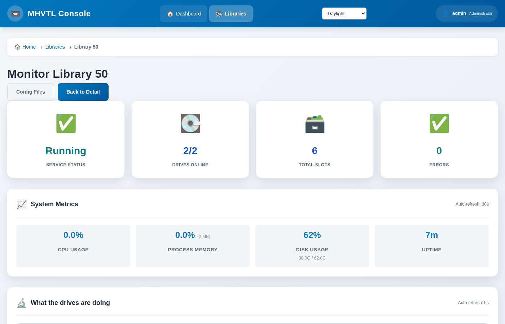

Watching a drive while it works
===============================

A tape drive is least willing to talk exactly when it is most interesting.
The kernel gives the SCSI reservation to whoever is writing, so for the whole
of a backup ``mt`` and ``mtx`` answer *device busy*, and every tool built on
them goes quiet.

This console shows the drive working anyway.

.. contents::
   :local:
   :depth: 1

On the library page
-------------------

The **Tape Drives** card has a line per drive, refreshed every five seconds:

.. image:: ../_static/shots/drive-writing.png
   :alt: Drive 31 writing G03001TA, 173.8 MB written, 14.8% of the tape
   :width: 100%

That is library 30 during a real backup. The bar is how full the cartridge
is; it turns amber past 75% and red past 90%.

The same panel is on the monitor page, at ``/libraries/monitor/<id>/``.

On the command line
-------------------

.. code-block:: console

   $ sudo mhvtl status activity 30

   Library 30: 1 of 4 drive(s) hold a tape, 1 working

   DRIVE  STATE    BARCODE   COUNTERS
   -----  -------  --------  ----------------------------------------------------
   31     writing  G03001TA  190.7 MB written - 15.8% of the tape, 2.41x compression
   32     empty    -         -
   33     empty    -         -
   34     empty    -         -

The same sentence the page shows, because both ask one service. Nothing is
worked out in the browser.

What the states mean
--------------------

``writing`` / ``reading``
   The counters grew since the previous reading.

``holding``
   A cartridge is loaded and the counters did not move.

``empty``
   No cartridge in the drive.

``silent``
   The drive daemon did not answer - usually one that is stopped. Check with
   ``systemctl status vtltape@31``.

Where the numbers come from
---------------------------

MHVTL's drive daemon keeps its own counters and reports them over the message
queue it already listens on, which the SCSI reservation does not touch. The
command that asks is our own addition to MHVTL.

``written``
   Bytes the backup handed the drive.

``% of the tape``
   How much of the cartridge is used - measured in what actually went to the
   medium, which is less than *written* when the data compresses.

``compression``
   Bytes in over bytes on the medium. Ordinary files compress about two to
   one; a ratio of 1.0 is not shown, because most test data does not compress
   and a clause saying so on every line is noise.

Two readings, not one
---------------------

MHVTL reports totals, not a rate, so *writing* means the number grew since
the last reading. A command run once has nothing to compare with and waits a
second to read again:

.. code-block:: console

   $ sudo mhvtl status activity 30 --settle 2     # two readings, 2s apart
   $ sudo mhvtl status activity 30 --settle 0     # one reading; never "writing"

The web page uses the second form, because it polls: the next refresh is a
better answer than a request that blocks.

If it says ``holding`` while a backup is running
------------------------------------------------

- The backup may be writing to a **different drive**. ``mhvtl status library
  30`` says which drive holds which cartridge.
- The two readings may have been more than two minutes apart, which makes the
  older one useless. Ask again.

If ``mt`` and the panel disagree
--------------------------------

They can, and the panel is usually right. ``mt`` reports what the kernel's
tape driver believes, which can be stale:

.. code-block:: console

   $ sudo mhvtl status drive 31      # through mt
   tape loaded       no

   $ sudo mhvtl status activity 30   # through the drive daemon
   31     holding  G03001TA  0 B written - 0.0% of the tape

   $ sudo mhvtl status library 30    # through the robot
   0      yes     G03001TA  1

Two of the three agree that the cartridge is in the drive, and they are the
two that matter: the robot moved it there and the daemon holds it. See
:doc:`../running/when-something-is-wrong`.
